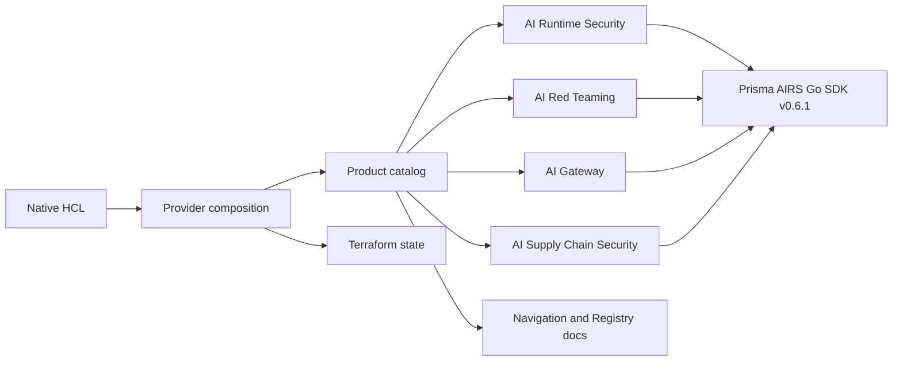

# Provider architecture

Terraform owns desired configuration and state. Each implemented product module owns its SDK adapter, resource lifecycle, data sources, and registration metadata.

## Product ownership

`internal/products/runtime`, `redteam`, `gateway`, and `supplychain` each expose a product definition. `internal/products/catalog.go` composes them. Constructors provide the public names; documentation metadata attaches each type to its guide and product.

`internal/provider` resolves shared OAuth defaults and nested endpoint settings, then delegates client construction. Product-owned client slots flow through the framework's provider data; resources retrieve their own SDK type. Credential copies and cross-product SDK fields are not retained in the composition module.

The current Supply Chain Security functionality is Model Security group and rule management. The provider does not execute runtime scans, model scan jobs, or red team inference. Network Broker channels remain externally managed. Gateway manages configuration objects; workspaces, IAM, inference and connected infrastructure remain external.

## Lifecycle modules

`runtime/profile_history.go` resolves complete named revision histories and guards pagination. `runtime/profile_plan.go` keeps unchanged policy leaves known while marking generated UUID/revision values unknown. A renamed profile leaves its previous history in AIRS.

`redteam/target_schema.go`, `target_config.go`, and `target_state.go` define native connection families, construct typed requests, and preserve desired secrets and payloads when reconciling readable fields.

`internal/tfutil/errors.go` classifies typed SDK errors and verifies remote absence after deletion. Group tombstones and archived prompt sets are absent resources; a bare error message cannot establish deletion.

`gateway/resource.go` reconciles stable identities, revision receipts, native values, desired sensitive inputs, import and verified deletion. Product-local definitions bind explicit typed SDK operations to each owned resource. `gateway/native.go` preserves concrete HCL types and config drift. Bindings merge a single owned workspace pair.

## Validation

Product-local tests cover conversion, revision plans, and pagination. Composed-provider tests cover registration, configuration routing, and live lifecycle acceptance. The catalog generator checks exact schema ownership, guide existence, and documentation freshness. Browser and pixel tests verify the shared Harness design. See [product refactor verification](product-refactor-verification.md) and the historical [SDK upgrade report](sdk-upgrade-verification.md).
