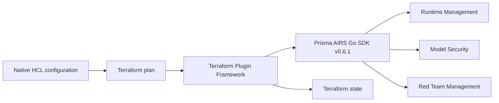

# Provider architecture

Terraform owns desired configuration and state. The provider maps native HCL into Go SDK v0.6.1 management requests and reconciles the service's canonical response.

## Service boundaries

The provider exposes configuration management resources and read-only reference catalogs. It does not execute Runtime scans, Model Security scan jobs, or Red Team inference. An existing Network Broker channel can be attached to a target; the provider never creates or removes channels.

One resolved OAuth credential set is passed to all clients. Explicit attributes take precedence over mapped environment variables. Service entitlement and authorization are verified through actual API operations.

## Deep lifecycle modules

`internal/provider/profile_history.go` resolves complete named revision histories and guards pagination. `profile_plan.go` keeps unchanged policy leaves known while marking generated UUID/revision values unknown. A renamed profile leaves its old history in the service.

`target_schema.go`, `target_config.go`, and `target_state.go` define native connection families, construct typed requests, and reconcile readable fields while preserving desired secrets and payloads. Arbitrary payload drift cannot be recovered reliably from masked or omitted service responses.

`errors.go` handles typed SDK error classification and verifies remote absence after deletion. Group tombstones and archived prompt sets are treated as absent resources; a bare error message never establishes deletion.

## Validation boundaries

Unit and race tests cover planning, schema, conversion, and pagination behavior. Credentialed acceptance tests exercise real resource lifecycles. Documentation examples are validated using the built provider; screenshot checks compare the UI with a pinned independent Harness design. The [verification report](sdk-upgrade-verification.md) states the limits of each gate.
