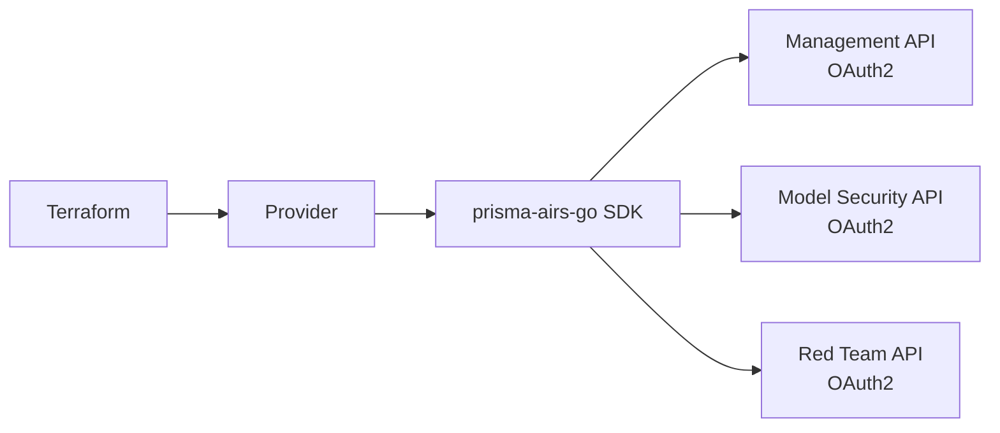

# Prisma AIRS Terraform Provider

Terraform provider for Palo Alto Networks **Prisma AI Runtime Security (AIRS)** — manage AI security infrastructure as code.

## Service Domains

| Domain | Resources | Description |
|--------|-----------|-------------|
| **Management** | Profiles, Topics, API Keys, Apps | Security profile and configuration CRUD |
| **Model Security** | Groups, Rules | Security group management and rules |
| **AI Red Teaming** | Targets, Custom Prompt Sets | Red team target and prompt set management |

## Key Features

- **AIRS management coverage** — resources and data sources for management, model security, and red team domains
- **Built on prisma-airs-go** — uses the official Go SDK for API interactions
- **Terraform Plugin Framework** — modern provider architecture with typed schemas
- **OAuth2 authentication** — client credentials grant for all APIs
- **Environment variable fallback** — provider config or env vars for all credentials

## Architecture

## Quick Links

- [Installation](getting-started/installation.md)
- [Quick Start](getting-started/quick-start.md)
- [Configuration](getting-started/configuration.md)
- [Provider Configuration Reference](reference/provider-configuration.md)
